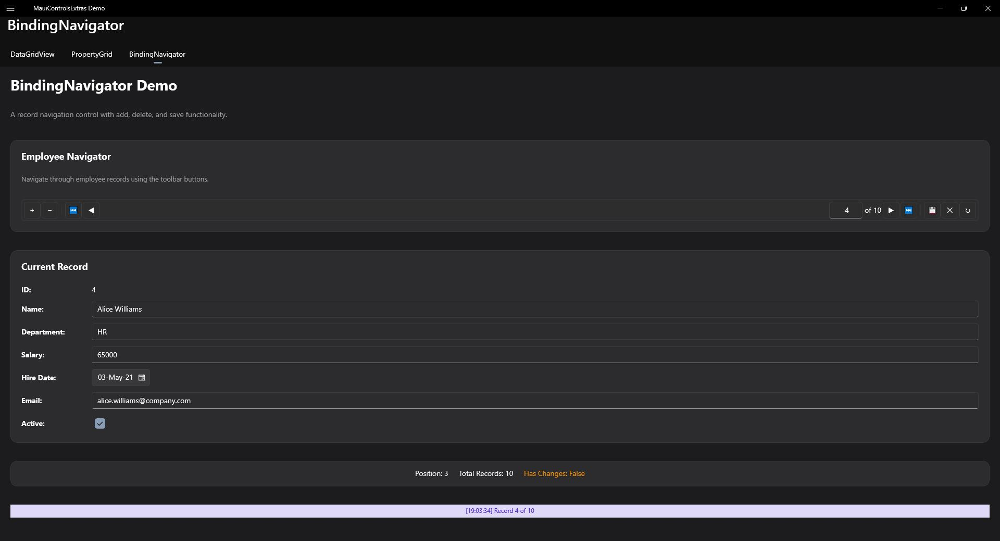

# BindingNavigator

A navigation toolbar for browsing data collections, similar to WinForms BindingNavigator.



## Features

- **Navigation Buttons** - First, Previous, Next, Last
- **Position Indicator** - Shows current position (e.g., "3 of 10")
- **Add/Delete** - Optional add and delete buttons
- **Save/Cancel** - Optional save and cancel buttons
- **Customizable Icons** - Change button icons/text
- **Keyboard Navigation** - Full keyboard support

## Basic Usage

```xml
<extras:BindingNavigator
    ItemsSource="{Binding Employees}"
    Position="{Binding CurrentPosition, Mode=TwoWay}" />
```

## With DataGrid

```xml
<VerticalStackLayout>
    <extras:BindingNavigator
        ItemsSource="{Binding Employees}"
        Position="{Binding CurrentPosition, Mode=TwoWay}"
        AddCommand="{Binding AddEmployeeCommand}"
        DeleteCommand="{Binding DeleteEmployeeCommand}" />

    <extras:DataGridView
        ItemsSource="{Binding Employees}"
        SelectedItem="{Binding CurrentEmployee, Mode=TwoWay}" />
</VerticalStackLayout>
```

## Button Visibility

```xml
<extras:BindingNavigator
    ItemsSource="{Binding Items}"
    ShowAddButton="True"
    ShowDeleteButton="True"
    ShowSaveButtons="True"
    ShowRefreshButton="True"
    ShowSeparators="True" />
```

## Custom Button Content

```xml
<extras:BindingNavigator
    ItemsSource="{Binding Items}"
    FirstButtonContent="|&lt;"
    PreviousButtonContent="&lt;"
    NextButtonContent="&gt;"
    LastButtonContent="&gt;|"
    AddButtonContent="New"
    DeleteButtonContent="Remove"
    SaveButtonContent="Save"
    CancelButtonContent="Cancel"
    RefreshButtonContent="Refresh" />
```

## Button Size

```xml
<!-- Default 32px buttons -->
<extras:BindingNavigator ButtonSize="32" />

<!-- Larger buttons -->
<extras:BindingNavigator ButtonSize="44" />

<!-- Compact buttons -->
<extras:BindingNavigator ButtonSize="24" />
```

## Code-Behind Navigation

```csharp
// Navigate programmatically
navigator.MoveFirst();
navigator.MovePrevious();
navigator.MoveNext();
navigator.MoveLast();
navigator.MoveTo(5);

// Check state
bool canMoveNext = navigator.CanMoveNext;
bool canMovePrevious = navigator.CanMovePrevious;
int currentPosition = navigator.Position;
int totalCount = navigator.Count;
```

## Keyboard Shortcuts

| Key | Action |
|-----|--------|
| Home | Move to first |
| End | Move to last |
| ← | Move to previous |
| → | Move to next |
| Page Up | Move to previous |
| Page Down | Move to next |
| Insert | Add new item |
| Delete | Delete current item |

## Events

| Event | Description |
|-------|-------------|
| PositionChanged | Current position changed |
| PositionChanging | Position is about to change (cancelable) |
| AddRequested | Add button clicked |
| DeleteRequested | Delete button clicked |
| SaveRequested | Save button clicked |
| CancelRequested | Cancel button clicked |
| RefreshRequested | Refresh button clicked |

## Commands

| Command | Description |
|---------|-------------|
| PositionChangedCommand | Execute when position changes |
| AddCommand | Execute when add is requested |
| DeleteCommand | Execute when delete is requested |
| SaveCommand | Execute when save is requested |
| CancelCommand | Execute when cancel is requested |
| RefreshCommand | Execute when refresh is requested |

## Properties

| Property | Type | Default | Description |
|----------|------|---------|-------------|
| ItemsSource | IEnumerable | null | Data source |
| Position | int | 0 | Current position (0-based) |
| Count | int | 0 | Total item count (read-only) |
| ShowAddButton | bool | true | Show add button |
| ShowDeleteButton | bool | true | Show delete button |
| ShowSaveButtons | bool | false | Show save/cancel buttons |
| ShowRefreshButton | bool | false | Show refresh button |
| ShowSeparators | bool | true | Show button separators |
| ButtonSize | double | 32 | Button size in pixels |
| CanMoveNext | bool | (computed) | Can move to next item |
| CanMovePrevious | bool | (computed) | Can move to previous item |
| FirstButtonContent | string | "⏮" | First button content |
| PreviousButtonContent | string | "◀" | Previous button content |
| NextButtonContent | string | "▶" | Next button content |
| LastButtonContent | string | "⏭" | Last button content |
| AddButtonContent | string | "+" | Add button content |
| DeleteButtonContent | string | "−" | Delete button content |
