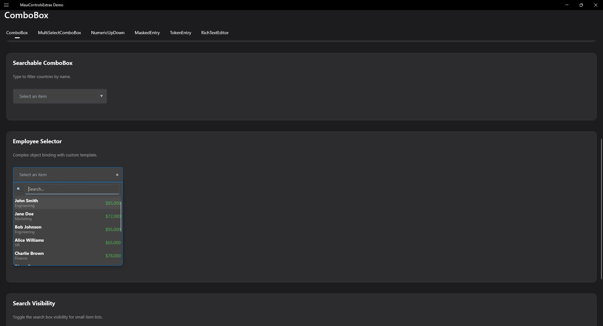
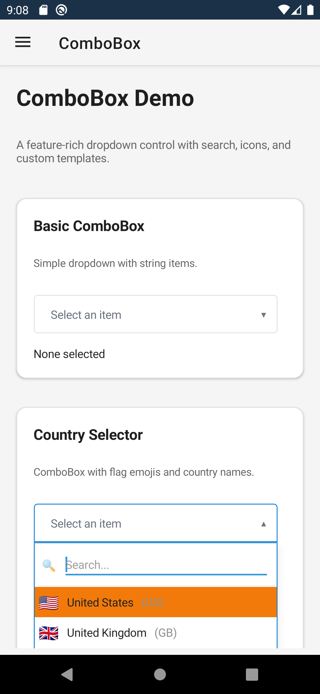

# ComboBox Control

The ComboBox control provides a dropdown selection experience similar to WinForms ComboBox, with additional features for mobile and cross-platform scenarios.

| Desktop | Mobile |
|---|---|
|  |  |

## Features

- **Searchable Dropdown** - Built-in search with debounced input (100ms)
- **Configurable Search** - Show or hide search box via `IsSearchVisible`
- **Complex Object Support** - Use `DisplayMemberPath` and `ValueMemberPath`
- **Image Support** - Display icons alongside text via `IconMemberPath`
- **Two-Way Binding** - Full support for MVVM patterns
- **Theme-Aware** - Automatic light/dark mode styling
- **Customizable** - Accent colors, placeholder text, visible item count

## Basic Usage

```xml
<extras:ComboBox ItemsSource="{Binding Items}"
                 SelectedItem="{Binding SelectedItem, Mode=TwoWay}"
                 DisplayMemberPath="Name"
                 Placeholder="Select an item..." />
```

## Using with Complex Objects

When your items are complex objects, use property paths:

```csharp
public class Activity
{
    public int Id { get; set; }
    public string Name { get; set; }
    public string Description { get; set; }
}
```

```xml
<extras:ComboBox ItemsSource="{Binding Activities}"
                 SelectedItem="{Binding SelectedActivity, Mode=TwoWay}"
                 DisplayMemberPath="Name"
                 ValueMemberPath="Id"
                 Placeholder="Select an activity..." />
```

## Custom Item Templates

For complete control over item appearance, use `ItemTemplate` with a `DataTemplate`:

```xml
<extras:ComboBox ItemsSource="{Binding Users}" SelectedItem="{Binding SelectedUser}">
    <extras:ComboBox.ItemTemplate>
        <DataTemplate x:DataType="models:User">
            <HorizontalStackLayout Spacing="10" Padding="5">
                <Image Source="{Binding AvatarUrl}" WidthRequest="32" HeightRequest="32" />
                <VerticalStackLayout>
                    <Label Text="{Binding FullName}" FontAttributes="Bold" />
                    <Label Text="{Binding Email}" FontSize="12" TextColor="Gray" />
                </VerticalStackLayout>
            </HorizontalStackLayout>
        </DataTemplate>
    </extras:ComboBox.ItemTemplate>
</extras:ComboBox>
```

> **Note:** When `ItemTemplate` is set, it takes precedence over `DisplayMemberPath` and `IconMemberPath`.

## Displaying Icons

To show images alongside text, set `IconMemberPath`:

```csharp
public class IconOption
{
    public string DisplayName { get; set; }
    public string IconImageSource { get; set; } // Path to image in Resources/Raw
}
```

```xml
<extras:ComboBox ItemsSource="{Binding Icons}"
                 SelectedItem="{Binding SelectedIcon, Mode=TwoWay}"
                 DisplayMemberPath="DisplayName"
                 IconMemberPath="IconImageSource"
                 VisibleItemCount="6" />
```

> **Note:** Icon images should be placed in the `Resources/Raw` folder of your MAUI project.

## Default Values

Set a default selection when the control loads:

```xml
<extras:ComboBox ItemsSource="{Binding Priorities}"
                 SelectedItem="{Binding Priority, Mode=TwoWay}"
                 DisplayMemberPath="Name"
                 ValueMemberPath="Code"
                 DefaultValue="normal" />
```

The `DefaultValue` will match against (in order):
1. `ValueMemberPath` property value
2. `DisplayMemberPath` property value
3. The item itself

## Customizing Appearance

### Accent Color

Change the focus border color:

```xml
<extras:ComboBox AccentColor="#FF5722"
                 ... />
```

### Visible Items

Control dropdown height:

```xml
<extras:ComboBox VisibleItemCount="8"
                 ... />
```

### Hiding the Search Box

For small item lists where search adds unnecessary complexity, hide the search input using `IsSearchVisible`:

```xml
<extras:ComboBox ItemsSource="{Binding StatusOptions}"
                 SelectedItem="{Binding SelectedStatus, Mode=TwoWay}"
                 DisplayMemberPath="Name"
                 IsSearchVisible="False"
                 Placeholder="Select status..." />
```

> **Note:** On iOS and Android, hiding the search box also prevents the software keyboard from appearing when the dropdown opens — the dropdown is touch-only on mobile platforms.

**When to hide the search box:**

| Scenario | Recommendation |
|----------|----------------|
| Less than 10 items | Hide search (`IsSearchVisible="False"`) |
| 10-50 items | Show search (default) |
| More than 50 items | Always show search |
| Yes/No/Status dropdowns | Hide search |
| Country/City selectors | Show search |

**Example - Priority Selector (no search):**

```xml
<extras:ComboBox ItemsSource="{Binding Priorities}"
                 SelectedItem="{Binding Priority}"
                 IsSearchVisible="False"
                 VisibleItemCount="4"
                 Placeholder="Select priority..." />
```

```csharp
public ObservableCollection<string> Priorities { get; } =
    new(["Low", "Normal", "High", "Critical"]);
```

**Example - Dynamic toggle with CheckBox:**

```xml
<VerticalStackLayout Spacing="10">
    <HorizontalStackLayout Spacing="8">
        <CheckBox IsChecked="{Binding ShowSearch}" />
        <Label Text="Enable Search" VerticalOptions="Center" />
    </HorizontalStackLayout>

    <extras:ComboBox ItemsSource="{Binding Items}"
                     SelectedItem="{Binding SelectedItem}"
                     IsSearchVisible="{Binding ShowSearch}"
                     Placeholder="Select item..." />
</VerticalStackLayout>
```

**Example - Auto-hide based on item count:**

```csharp
public partial class MyViewModel : ObservableObject
{
    [ObservableProperty]
    private bool _isSearchVisible = true;

    [ObservableProperty]
    private ObservableCollection<MyItem> _items;

    partial void OnItemsChanged(ObservableCollection<MyItem> value)
    {
        // Automatically hide search for small lists
        IsSearchVisible = value?.Count >= 10;
    }
}
```

## Popup Mode

When `PopupMode="True"`, the ComboBox shows its dropdown as an anchored overlay popup instead of inline. This is useful for standalone ComboBoxes where the inline dropdown would be clipped or positioned incorrectly.

### Standalone Usage (Self-Hosting)

When no external handler subscribes to the `PopupRequested` event, the ComboBox automatically hosts its own popup overlay anchored to itself:

```xml
<extras:ComboBox ItemsSource="{Binding Items}"
                 SelectedItem="{Binding SelectedItem}"
                 DisplayMemberPath="Name"
                 PopupMode="True"
                 Placeholder="Select an item..." />
```

The popup automatically positions below the ComboBox, flipping above if there isn't enough space below.

### PopupPlacement Property

Control the preferred placement of the popup:

```xml
<!-- Prefer above the ComboBox -->
<extras:ComboBox PopupMode="True"
                 PopupPlacement="Top"
                 ... />
```

| Value | Description |
|-------|-------------|
| `Auto` (default) | Prefer below, flip above if insufficient space |
| `Bottom` | Prefer below, flip above if insufficient space |
| `Top` | Prefer above, flip below if insufficient space |

### Manual Popup Control

For advanced scenarios, use `ComboBoxPopupContent` directly:

```csharp
var popup = new ComboBoxPopupContent
{
    ItemsSource = myItems,
    DisplayMemberPath = "Name",
    AnchorView = myComboBox
};
popup.ShowAnchored();
```

### External Handling (DataGrid)

When an external handler subscribes to `PopupRequested` (e.g., DataGridView), self-hosting is skipped and the handler manages popup display. This preserves full backwards compatibility.

## Programmatic Control

### Open/Close

```csharp
myComboBox.Open();
myComboBox.Close();
```

### Clear Selection

```csharp
myComboBox.ClearSelection();
```

### Refresh Items

```csharp
myComboBox.RefreshItems();
```

## Events

### SelectionChanged

Fired when the selection changes:

```csharp
private void ComboBox_SelectionChanged(object sender, object? e)
{
    if (e is MyItem item)
    {
        // Handle selection
    }
}
```

### Opened/Closed

Track dropdown state:

```csharp
private void ComboBox_Opened(object sender, EventArgs e)
{
    // Dropdown opened
}

private void ComboBox_Closed(object sender, EventArgs e)
{
    // Dropdown closed
}
```

## Context Menu

ComboBox implements `IContextMenuSupport` for right-click (desktop) and long-press (mobile) context menus.

### Default Context Menu

By default, a context menu with Copy, Cut, Paste, Select All, and Clear options is shown. Disable with:

```xml
<extras:ComboBox
    ItemsSource="{Binding Countries}"
    ShowDefaultContextMenu="False" />
```

### Custom Context Menu Items

```csharp
comboBox.ContextMenuItems.Add("Custom Action", () => DoSomething());
```

### Context Menu Event

```csharp
comboBox.ContextMenuOpening += (sender, e) =>
{
    // e.Items - the menu items collection (add/remove items)
    // e.Cancel = true to prevent showing the menu
    e.Items.Add("Custom Action", () => DoSomething());
};
```

## Keyboard Shortcuts

| Key | Action |
|-----|--------|
| ↓ (Down) | Open dropdown / Move to next item |
| ↑ (Up) | Move to previous item |
| Enter | Select highlighted item / Open dropdown |
| Space | Open dropdown |
| Escape | Close dropdown |
| Home | Move to first item |
| End | Move to last item |
| Tab | Select filtered/highlighted item (Windows only) |

> **Note:** Tab autocomplete selects the single filtered result, or the currently highlighted item if multiple results exist. This behavior is currently Windows-only.

## Styling

The ComboBox automatically adapts to light/dark themes. Key colors:

| Element | Light Theme | Dark Theme |
|---------|-------------|------------|
| Background | White | #424242 |
| Border | #BDBDBD | #9E9E9E |
| Text | #212121 | White |
| Placeholder | #6B7280 | #9CA3AF |
| Focus Border | AccentColor | AccentColor |

## Validation

ComboBox implements `IValidatable` for built-in validation support.

```xml
<extras:ComboBox
    ItemsSource="{Binding Items}"
    SelectedItem="{Binding SelectedItem}"
    IsRequired="True"
    RequiredErrorMessage="Please select an item"
    ValidateCommand="{Binding OnValidationCommand}" />
```

### Checking Validation State

```csharp
if (!comboBox.IsValid)
{
    foreach (var error in comboBox.ValidationErrors)
    {
        Debug.WriteLine(error);
    }
}

// Trigger validation manually
var result = comboBox.Validate();
```

### Validation Properties

| Property | Type | Default | Description |
|----------|------|---------|-------------|
| IsRequired | bool | false | Whether a selection is required |
| RequiredErrorMessage | string | "This field is required." | Error message when required but nothing selected |
| IsValid | bool | (read-only) | Current validation state |
| ValidationErrors | IReadOnlyList&lt;string&gt; | (read-only) | List of validation error messages |
| ValidateCommand | ICommand | null | Command executed when validation occurs |

### Events

| Event | Description |
|-------|-------------|
| ValidationChanged | Fired when IsValid state changes |

## Best Practices

1. **Use DisplayMemberPath** for complex objects instead of overriding ToString()
2. **Keep VisibleItemCount reasonable** (5-8 items) for mobile
3. **Provide meaningful Placeholder text** to guide users
4. **Use ValueMemberPath** when binding to IDs or codes
5. **Handle null selection** gracefully in your ViewModel
6. **Hide search for small lists** - Use `IsSearchVisible="False"` for dropdowns with fewer than 10 items to reduce UI clutter
7. **Consider dynamic search visibility** - Bind `IsSearchVisible` to automatically toggle based on item count

