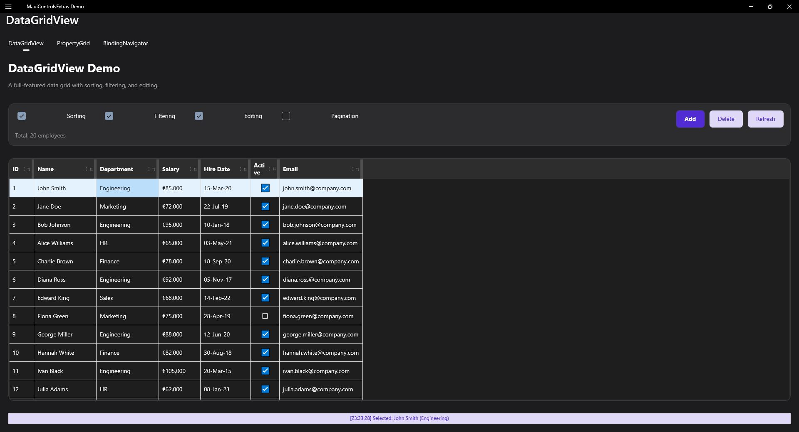
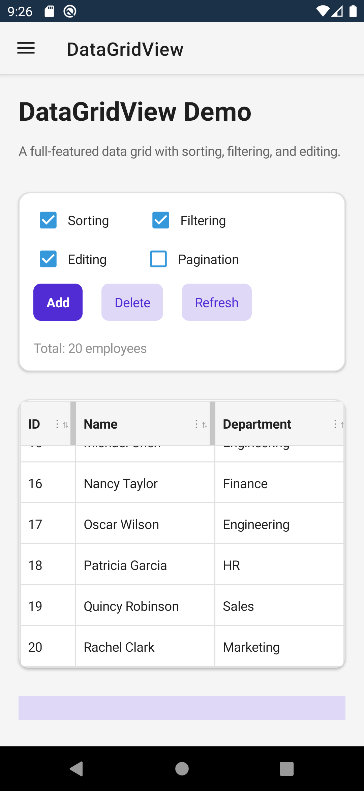

# DataGridView

A feature-rich data grid control for displaying and editing tabular data.

| Desktop | Mobile |
|---|---|
|  |  |

## Features

- **Sorting** - Click column headers to sort
- **Filtering** - Filter data by column values
- **Grouping** - Group rows by column values
- **Editing** - In-cell editing with validation
- **Selection** - Single, multiple, and range selection
- **Virtual Scrolling** - Efficient handling of large datasets
- **Column Types** - Text, numeric, checkbox, combo box, date picker, time picker columns
- **Context Menu** - Native right-click context menus with platform-specific implementations
- **Export** - Export to CSV, TSV, JSON formats
- **Print** - Print with customizable options
- **Undo/Redo** - Full undo/redo support for edits
- **Clipboard** - Copy/paste support
- **Keyboard Navigation** - Full keyboard support for desktop

## Basic Usage

```xml
<extras:DataGridView ItemsSource="{Binding Employees}">
    <extras:DataGridView.Columns>
        <extras:DataGridTextColumn Header="Name" Binding="Name" />
        <extras:DataGridTextColumn Header="Department" Binding="Department" />
        <extras:DataGridNumericColumn Header="Salary" Binding="Salary" Format="C0" />
        <extras:DataGridCheckBoxColumn Header="Active" Binding="IsActive" />
    </extras:DataGridView.Columns>
</extras:DataGridView>
```

## Editable Grid

```xml
<extras:DataGridView
    ItemsSource="{Binding Employees}"
    CanUserEdit="True"
    CanUserAddRows="True"
    CanUserDeleteRows="True"
    CellEditEndedCommand="{Binding SaveChangesCommand}">
    ...
</extras:DataGridView>
```

## Sorting and Filtering

```xml
<extras:DataGridView
    ItemsSource="{Binding Employees}"
    CanUserSort="True"
    CanUserFilter="True"
    DefaultSortColumn="Name"
    DefaultSortDirection="Ascending">
    ...
</extras:DataGridView>
```

Per-column filtering can be controlled via `DataGridColumn.CanUserFilter`. When a column is filtered, `IsFiltered` returns `true` and the active filter state is available through `FilterValues` (checkbox-list selection) and `FilterText` (text search).

> **Touch targets**: The filter icon in column headers meets the 44×44pt minimum touch target recommended by Apple HIG and Material Design guidelines.

## Column Types

### DataGridTextColumn

```xml
<extras:DataGridTextColumn
    Header="Name"
    Binding="Name"
    Width="200"
    IsReadOnly="False"
    MaxLength="100" />
```

### DataGridNumericColumn

```xml
<extras:DataGridNumericColumn
    Header="Price"
    Binding="Price"
    Format="C2"
    Minimum="0"
    Maximum="10000"
    Increment="0.01" />
```

### DataGridCheckBoxColumn

```xml
<extras:DataGridCheckBoxColumn
    Header="Active"
    Binding="IsActive" />
```

### DataGridComboBoxColumn

Uses the library's custom ComboBox control with built-in search/filtering support.

```xml
<extras:DataGridComboBoxColumn
    Header="Category"
    Binding="CategoryId"
    ItemsSource="{Binding Categories}"
    DisplayMemberPath="Name"
    SelectedValuePath="Id"
    Placeholder="Search categories..."
    VisibleItemCount="8" />
```

**Features:**
- Search/filter dropdown items by typing
- Keyboard navigation (↑/↓/Enter/Escape/Home/End)
- Customizable placeholder text
- Configurable visible item count

### DataGridDatePickerColumn

```xml
<extras:DataGridDatePickerColumn
    Header="Hire Date"
    Binding="HireDate"
    Format="d"
    MinimumDate="2020-01-01"
    MaximumDate="2030-12-31" />
```

### DataGridTimePickerColumn

```xml
<extras:DataGridTimePickerColumn
    Header="Start Time"
    Binding="StartTime"
    Format="t" />
```

## Context Menu

The DataGridView supports native context menus with platform-specific implementations:

- **Windows**: MenuFlyout with FontIcon support
- **macOS**: UIMenu via UIContextMenuInteraction
- **iOS**: UIAlertController action sheet
- **Android**: PopupMenu

### Context Menu Triggers

| Platform | Right-click | Long-press (touch) |
|----------|------------|-------------------|
| Windows  | Yes (RightTapped) | Yes (Holding) |
| macOS    | Yes (secondary click / two-finger tap) | Yes (500ms hold) |
| iOS      | N/A | Yes (500ms hold) |
| Android  | N/A | Yes (500ms hold) |

> **Note:** When a cell is in text edit mode, long-press and right-click are passed through to the native text control for text selection — the DataGrid context menu is suppressed.

### Default Context Menu

The default context menu provides Copy, Cut, Paste, Undo, Redo, and Delete actions:

```xml
<extras:DataGridView
    ItemsSource="{Binding Items}"
    ShowDefaultContextMenu="True" />
```

### Custom Context Menu Items

Add custom items via XAML or code:

```xml
<extras:DataGridView ItemsSource="{Binding Items}">
    <extras:DataGridView.ContextMenuItems>
        <extras:ContextMenuItem Text="View Details"
                                Command="{Binding ViewDetailsCommand}"
                                IconGlyph="&#xE8A5;"
                                KeyboardShortcut="Ctrl+D" />
        <extras:ContextMenuItem IsSeparator="True" />
        <extras:ContextMenuItem Text="Export Row"
                                Command="{Binding ExportRowCommand}"
                                IconGlyph="&#xEDE1;" />
    </extras:DataGridView.ContextMenuItems>
</extras:DataGridView>
```

### Dynamic Context Menu

Handle `ContextMenuItemsOpening` for dynamic customization:

```csharp
private void OnContextMenuOpening(object sender, DataGridContextMenuOpeningEventArgs e)
{
    // Add items based on cell context
    if (e.Column?.Header == "Status")
    {
        e.Items.Add("Mark as Complete", () => MarkComplete(e.Item));
        e.Items.Add("Mark as Pending", () => MarkPending(e.Item));
    }

    // Remove default items if needed
    var deleteItem = e.Items.FindByText("Delete");
    if (deleteItem != null && !CanDeleteRow(e.Item))
    {
        deleteItem.IsEnabled = false;
    }

    // Cancel the menu entirely
    if (!ShouldShowMenu(e.Item))
    {
        e.Cancel = true;
    }
}
```

### Programmatic Context Menu

Show the context menu programmatically:

```csharp
await dataGrid.ShowContextMenuAsync(
    item: selectedItem,
    column: currentColumn,
    rowIndex: 5,
    columnIndex: 2,
    position: new Point(100, 200));
```

## Edit Mode Behavior

When editing cells, the DataGridView provides a consistent editing experience:

### Text/Entry Columns
- **Enter**: Commit edit and move to next row
- **Escape**: Cancel edit and restore original value
- **Tab**: Commit edit and move to next cell
- **Click another cell**: Commit current edit and begin editing new cell
- **Right-click**: Opens native TextBox context menu (Cut/Copy/Paste/Select All) without closing edit mode

### Picker Columns (ComboBox, DatePicker, TimePicker)
- Dropdown stays open when activated
- Selection commits the edit
- **Escape**: Cancel and close dropdown
- Click outside: Commit selection

## Virtual Scrolling

For large datasets, enable virtual scrolling:

```xml
<extras:DataGridView
    ItemsSource="{Binding LargeDataSet}"
    EnableVirtualization="True"
    VirtualizationBufferSize="5"
    RowHeight="44" />
```

## Selection

```xml
<extras:DataGridView
    ItemsSource="{Binding Items}"
    SelectionMode="Multiple"
    SelectedItem="{Binding SelectedItem, Mode=TwoWay}"
    SelectedItems="{Binding SelectedItems}"
    SelectionChangedCommand="{Binding HandleSelectionCommand}" />
```

## Grouping

```xml
<extras:DataGridView
    ItemsSource="{Binding Employees}"
    GroupByColumn="Department"
    ShowGroupHeaders="True"
    IsGroupExpandedByDefault="True" />
```

## Export

```csharp
// Export to CSV
var csv = await myDataGrid.ExportAsync(new DataGridExportOptions
{
    Format = ExportFormat.Csv,
    IncludeHeaders = true,
    VisibleColumnsOnly = true
});

// Export to clipboard
await myDataGrid.CopyToClipboardAsync();
```

## Print

```csharp
await myDataGrid.PrintAsync(new DataGridPrintOptions
{
    Title = "Employee Report",
    Orientation = PageOrientation.Landscape,
    IncludeGridLines = true
});
```

## Keyboard Shortcuts

| Key | Action |
|-----|--------|
| ↑ / ↓ | Move between rows |
| ← / → | Move between columns |
| Enter | Commit edit, move down |
| Tab | Commit edit, move right |
| F2 | Begin editing |
| Escape | Cancel edit |
| Delete | Delete selected rows |
| Ctrl+C | Copy selection |
| Ctrl+V | Paste |
| Ctrl+Z | Undo |
| Ctrl+Y | Redo |
| Home/End | First/last column |
| Ctrl+Home/End | First/last cell |

## Events

| Event | Description |
|-------|-------------|
| SelectionChanged | Selection has changed |
| CellEditStarted | Cell editing started |
| CellEditEnded | Cell editing completed |
| RowEditEnded | Row editing completed |
| SortChanged | Sort column/direction changed |
| FilterChanged | Filter applied/removed |
| ContextMenuOpening | Right-click menu opening (legacy) |
| ContextMenuItemsOpening | Right-click menu opening with full item access |

## Commands

| Command | Description |
|---------|-------------|
| SelectionChangedCommand | Execute when selection changes |
| CellEditEndedCommand | Execute when cell edit completes |
| SortChangedCommand | Execute when sorting changes |
| DeleteRowCommand | Execute when row is deleted |

## AOT / NativeAOT Support

When publishing with `PublishAot=true` or trimming enabled, column `PropertyPath` bindings use reflection that may be removed by the trimmer.

### Option 1: Use Func-based properties on columns (recommended)

```csharp
var nameColumn = new DataGridTextColumn
{
    Header = "Name",
    Binding = "Name",
    CellValueFunc = item => ((Product)item).Name,
    CellValueSetter = (item, value) => ((Product)item).Name = (string)value!
};
```

| Property | Type | Description |
|---|---|---|
| `CellValueFunc` | `Func<object, object?>` | AOT-safe getter. When set, takes priority over reflection via `PropertyPath`. |
| `CellValueSetter` | `Action<object, object?>` | AOT-safe setter. When set, takes priority over reflection via `PropertyPath`. |

For `DataGridComboBoxColumn`:

| Property | Type | Description |
|---|---|---|
| `DisplayMemberFunc` | `Func<object, string?>` | AOT-safe alternative to `DisplayMemberPath` |
| `SelectedValueFunc` | `Func<object, object?>` | AOT-safe alternative to `SelectedValuePath` |

### Option 2: Preserve model types

```csharp
[DynamicDependency(DynamicallyAccessedMemberTypes.PublicProperties, typeof(Product))]
```

## Properties Reference

See [DataGridView API Reference](../api/datagridview.md) for complete property list.

