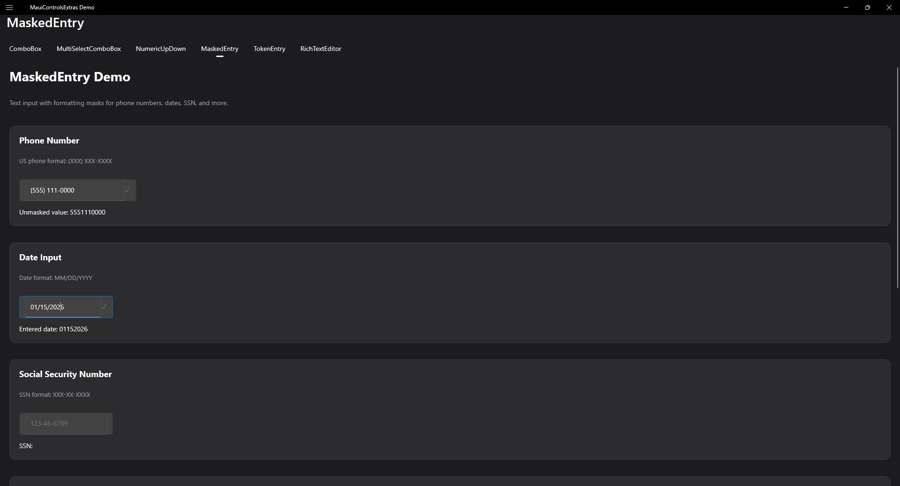

# MaskedEntry

A text input control with format masking for structured data entry.

| Desktop | Mobile |
|---|---|
|  | _Pending mobile screenshot_ |

## Features

- **Format Masks** - Predefined and custom masks
- **Input Validation** - Automatic character validation
- **Prompt Characters** - Show mask format visually
- **Keyboard Navigation** - Full keyboard support
- **IValidatable Support** - Built-in validation

## Basic Usage

```xml
<extras:MaskedEntry
    Mask="00/00/0000"
    Text="{Binding DateValue, Mode=TwoWay}"
    Placeholder="MM/DD/YYYY" />
```

## Mask Characters

| Character | Description |
|-----------|-------------|
| `0` | Required digit (0-9) |
| `9` | Optional digit |
| `A` | Required letter (A-Z, a-z) |
| `a` | Optional letter |
| `L` | Required letter, auto uppercase |
| `?` | Optional letter, auto uppercase |
| `&` | Required any character |
| `C` | Optional any character |
| `\` | Escape next character as literal |

Any other character is treated as a literal and displayed as-is in the mask.

## Predefined Mask Constants

```csharp
MaskedEntry.CreditCard   // 0000 0000 0000 0000
MaskedEntry.DateUS       // 00/00/0000
MaskedEntry.DateISO      // 0000-00-00
MaskedEntry.TimeHHMM     // 00:00
MaskedEntry.TimeHHMMSS   // 00:00:00
```

## Common Masks

### Dates

```xml
<extras:MaskedEntry Mask="00/00/0000" />
<extras:MaskedEntry Mask="0000-00-00" />
```

### Credit Cards

```xml
<extras:MaskedEntry Mask="0000 0000 0000 0000" />
```

### Time

```xml
<extras:MaskedEntry Mask="00:00" />
<extras:MaskedEntry Mask="00:00:00" />
```

## Text Values

- `Text` - The raw unmasked value (user input only)
- `MaskedText` - The formatted value with mask literals applied

```xml
<extras:MaskedEntry
    Mask="0000 0000 0000 0000"
    Text="{Binding CardNumber}" />
```

To include mask literals in the `Text` value:

```xml
<extras:MaskedEntry
    Mask="0000 0000 0000 0000"
    IncludeLiterals="True"
    Text="{Binding FormattedCardNumber}" />
```

## Validation

MaskedEntry implements `IValidatable` for built-in validation support.

```xml
<extras:MaskedEntry
    Mask="00/00/0000"
    IsRequired="True"
    RequiredErrorMessage="Date is required"
    ShowValidationIcon="True" />
```
