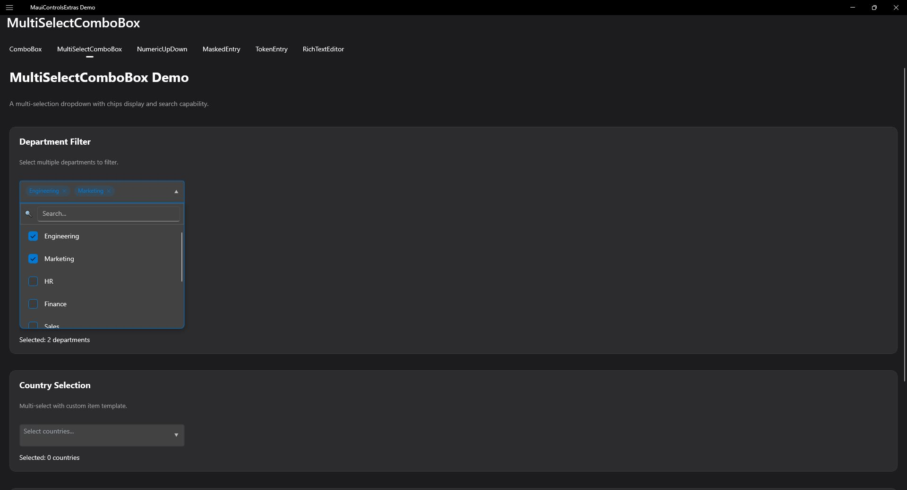
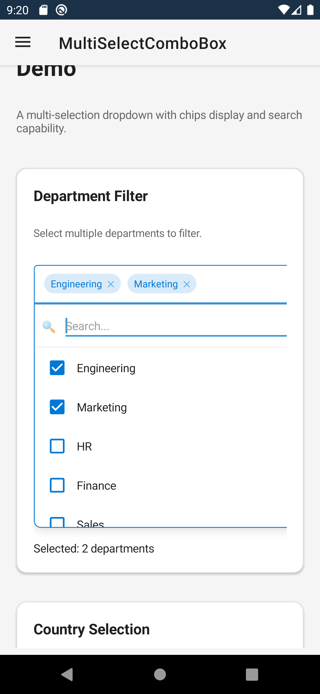

# MultiSelectComboBox

A dropdown control that allows selecting multiple items with checkboxes.

| Desktop | Mobile |
|---|---|
|  |  |

## Features

- **Multiple Selection** - Select multiple items via checkboxes
- **Search/Filter** - Filter items by typing
- **Select All** - Quick select/deselect all option
- **Custom Display** - Configure how selections are shown
- **Data Binding** - Full MVVM support
- **Keyboard Navigation** - Full keyboard support

## Basic Usage

```xml
<extras:MultiSelectComboBox
    ItemsSource="{Binding Categories}"
    SelectedItems="{Binding SelectedCategories}"
    DisplayMemberPath="Name"
    Placeholder="Select categories..." />
```

## Custom Item Templates

For complete control over item appearance, use `ItemTemplate` with a `DataTemplate`:

```xml
<extras:MultiSelectComboBox ItemsSource="{Binding Tags}" SelectedItems="{Binding SelectedTags}">
    <extras:MultiSelectComboBox.ItemTemplate>
        <DataTemplate x:DataType="models:Tag">
            <HorizontalStackLayout Spacing="8">
                <BoxView Color="{Binding Color}" WidthRequest="16" HeightRequest="16" CornerRadius="8" />
                <Label Text="{Binding Name}" VerticalOptions="Center" />
            </HorizontalStackLayout>
        </DataTemplate>
    </extras:MultiSelectComboBox.ItemTemplate>
</extras:MultiSelectComboBox>
```

> **Note:** The checkbox for selection is automatically added to the left of your template content.

## Display Options

```xml
<extras:MultiSelectComboBox
    ItemsSource="{Binding Items}"
    SelectedItems="{Binding SelectedItems}"
    DisplayMode="Chips"
    MaxDisplayedChips="3"
    Separator=", " />
```

### Display Modes

- `Text` - Comma-separated text
- `Chips` - Individual removable chips
- `Count` - "3 items selected"

## Select All

```xml
<extras:MultiSelectComboBox
    ItemsSource="{Binding Items}"
    ShowSelectAll="True"
    SelectAllText="Select All" />
```

## Filtering

```xml
<extras:MultiSelectComboBox
    ItemsSource="{Binding Items}"
    IsSearchable="True"
    FilterMemberPath="Name"
    SearchPlaceholder="Type to search..." />
```

## Context Menu

MultiSelectComboBox implements `IContextMenuSupport` for right-click (desktop) and long-press (mobile) context menus.

### Default Context Menu

By default, a context menu with Copy, Cut, Paste, Select All, and Clear options is shown. Disable with:

```xml
<extras:MultiSelectComboBox
    ItemsSource="{Binding Items}"
    ShowDefaultContextMenu="False" />
```

### Custom Context Menu Items

```csharp
multiSelectComboBox.ContextMenuItems.Add("Custom Action", () => DoSomething());
```

### Context Menu Event

```csharp
multiSelectComboBox.ContextMenuOpening += (sender, e) =>
{
    // e.Items - the menu items collection (add/remove items)
    // e.Cancel = true to prevent showing the menu
    e.Items.Add("Custom Action", () => DoSomething());
};
```

## Keyboard Shortcuts

| Key | Action |
|-----|--------|
| ↓ | Open dropdown / Move to next item |
| ↑ | Move to previous item |
| Enter | Open dropdown |
| Space | Toggle selection on highlighted item |
| Escape | Close dropdown |
| Home | Move to first item |
| End | Move to last item |
| Ctrl+A | Select all |

## Events

| Event | Description |
|-------|-------------|
| SelectionChanged | Selection has changed |
| DropdownOpened | Dropdown was opened |
| DropdownClosed | Dropdown was closed |

## Validation

MultiSelectComboBox implements `IValidatable` for built-in validation support.

```xml
<extras:MultiSelectComboBox
    ItemsSource="{Binding Categories}"
    SelectedItems="{Binding SelectedCategories}"
    IsRequired="True"
    RequiredErrorMessage="Please select at least one category"
    ValidateCommand="{Binding OnValidationCommand}" />
```

### Checking Validation State

```csharp
if (!multiSelectComboBox.IsValid)
{
    foreach (var error in multiSelectComboBox.ValidationErrors)
    {
        Debug.WriteLine(error);
    }
}

// Trigger validation manually
var result = multiSelectComboBox.Validate();
```

### Validation Properties

| Property | Type | Default | Description |
|----------|------|---------|-------------|
| IsRequired | bool | false | Whether at least one selection is required |
| RequiredErrorMessage | string | "This field is required." | Error message when required but nothing selected |
| IsValid | bool | (read-only) | Current validation state |
| ValidationErrors | IReadOnlyList&lt;string&gt; | (read-only) | List of validation error messages |
| ValidateCommand | ICommand | null | Command executed when validation occurs |

## Selection Properties

| Property | Type | Default | Description |
|----------|------|---------|-------------|
| SelectedItems | IList | null | Selected item objects (two-way bindable) |
| SelectedIndices | IList&lt;int&gt; | null | Selected item indices in `ItemsSource` (two-way bindable) |

Both properties stay in sync automatically. Indices refer to positions in the original `ItemsSource`, not the filtered list. Out-of-range indices are silently ignored.

## Selecting by Indices

Use `SelectedIndices` for position-based multi-selection when you work with indices rather than object references:

```xml
<extras:MultiSelectComboBox
    ItemsSource="{Binding Departments}"
    SelectedIndices="{Binding SelectedDepartmentIndices}"
    Placeholder="Select departments..." />
```

> **Notes:**
> - Indices refer to positions in `ItemsSource`, not the filtered dropdown list.
> - Out-of-range indices are silently ignored — no crash, no selection.
> - `SelectedIndices` is auto-created as `ObservableCollection<int>` on demand if null.
> - `MaxSelections` is respected when syncing items from indices.
> - Setting `SelectedIndices` before `ItemsSource` is supported — selection resolves once `ItemsSource` arrives.

## Properties

| Property | Type | Description |
|----------|------|-------------|
| ItemsSource | IEnumerable | Items to display |
| SelectedItems | IList | Selected items |
| SelectedIndices | IList&lt;int&gt; | Selected item indices in ItemsSource |
| DisplayMemberPath | string | Property to display |
| ShowSelectAll | bool | Show "Select All" option |
| DisplayMode | DisplayMode | How to show selections |
| IsSearchable | bool | Enable filtering |
| MaxDropdownHeight | double | Max dropdown height |

## AOT / NativeAOT Support

When publishing with `PublishAot=true` or trimming enabled, `DisplayMemberPath` uses reflection that may be removed by the trimmer.

### Option 1: Use Func-based properties (recommended)

```csharp
myMultiSelect.DisplayMemberFunc = item => ((Country)item).Name;
```

| Property | Type | Description |
|---|---|---|
| `DisplayMemberFunc` | `Func<object, string?>` | AOT-safe alternative to `DisplayMemberPath`. When set, takes priority over the string path. |

### Option 2: Use ItemTemplate with compiled bindings

```xml
<extras:MultiSelectComboBox ItemsSource="{Binding Countries}">
    <extras:MultiSelectComboBox.ItemTemplate>
        <DataTemplate x:DataType="models:Country">
            <Label Text="{Binding Name}" />
        </DataTemplate>
    </extras:MultiSelectComboBox.ItemTemplate>
</extras:MultiSelectComboBox>
```

### Option 3: Preserve model types

```csharp
[DynamicDependency(DynamicallyAccessedMemberTypes.PublicProperties, typeof(Country))]
```

