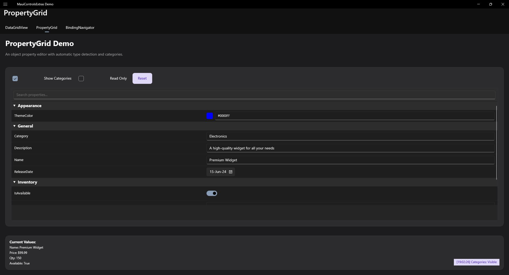
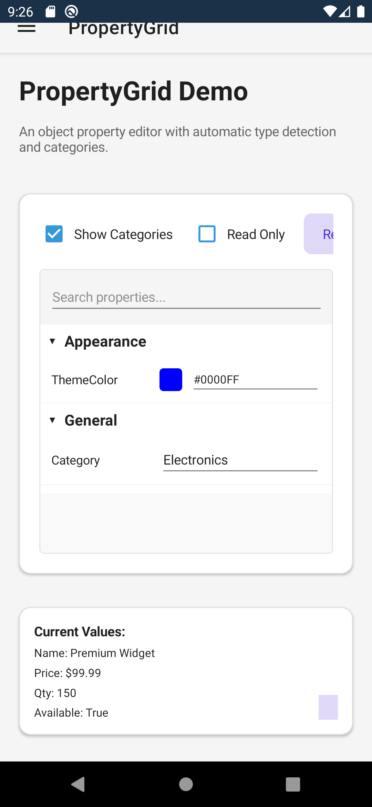

# PropertyGrid

A property grid control that generates an editable UI from an object's properties, similar to Visual Studio's Properties panel.

| Desktop | Mobile |
|---|---|
|  |  |

## Features

- **Auto-Generation** - Automatically generates editors for properties
- **Categories** - Group properties by category
- **Search** - Filter properties by name
- **Type Editors** - Built-in editors for common types
- **Read-Only Support** - Read-only mode for viewing
- **Description Panel** - Show property descriptions
- **Keyboard Navigation** - Full keyboard support

## Basic Usage

```xml
<extras:PropertyGrid SelectedObject="{Binding MyObject}" />
```

## With Categorization

```csharp
public class Person
{
    [Category("Personal")]
    [Description("The person's full name")]
    public string Name { get; set; }

    [Category("Personal")]
    [Description("The person's age in years")]
    public int Age { get; set; }

    [Category("Contact")]
    [Description("Email address")]
    public string Email { get; set; }

    [Category("Contact")]
    [Description("Phone number")]
    public string Phone { get; set; }
}
```

```xml
<extras:PropertyGrid
    SelectedObject="{Binding Person}"
    ShowCategories="True" />
```

## Sort Modes

```xml
<!-- Categorized (default) -->
<extras:PropertyGrid SortMode="Categorized" />

<!-- Alphabetical -->
<extras:PropertyGrid SortMode="Alphabetical" />

<!-- No sorting (declaration order) -->
<extras:PropertyGrid SortMode="None" />
```

## Search Box

```xml
<!-- With search (default) -->
<extras:PropertyGrid ShowSearchBox="True" />

<!-- Without search -->
<extras:PropertyGrid ShowSearchBox="False" />

<!-- Bind to search text -->
<extras:PropertyGrid SearchText="{Binding FilterText, Mode=TwoWay}" />
```

## Description Panel

```xml
<!-- Show description panel (default) -->
<extras:PropertyGrid ShowDescription="True" />

<!-- Hide description panel -->
<extras:PropertyGrid ShowDescription="False" />
```

## Read-Only Mode

```xml
<extras:PropertyGrid
    SelectedObject="{Binding MyObject}"
    IsReadOnly="True" />
```

## Property Attributes

```csharp
public class Settings
{
    [Category("General")]
    [DisplayName("Application Name")]
    [Description("The name displayed in the title bar")]
    public string AppName { get; set; }

    [Category("General")]
    [Browsable(false)]  // Hide from PropertyGrid
    public string InternalId { get; set; }

    [Category("Appearance")]
    [DisplayName("Primary Color")]
    [Description("The main theme color")]
    public Color PrimaryColor { get; set; }

    [Category("Appearance")]
    [ReadOnly(true)]  // Read-only in PropertyGrid
    public string Version { get; set; }

    [Category("Advanced")]
    [DefaultValue(100)]
    [Description("Maximum cache size in MB")]
    public int CacheSize { get; set; } = 100;
}
```

## Custom Type Editors

```csharp
// Register custom editor for a type
PropertyGrid.RegisterEditor<MyCustomType, MyCustomEditor>();

// Use TypeEditor attribute
[TypeEditor(typeof(ColorPickerEditor))]
public Color BackgroundColor { get; set; }
```

> **AOT note:** Under NativeAOT/trimming, custom editor types referenced via `[TypeEditor]` or `RegisterEditor<T, TEditor>()` must be preserved. Add `[DynamicDependency(DynamicallyAccessedMemberTypes.PublicConstructors, typeof(MyCustomEditor))]` to your startup code or use `[DynamicDependency]` attributes to ensure the editor type is not trimmed.

## Expand/Collapse Categories

```xml
<!-- All categories expanded by default -->
<extras:PropertyGrid ExpandAllCategories="True" />

<!-- Categories collapsed by default -->
<extras:PropertyGrid ExpandAllCategories="False" />
```

## Code-Behind Operations

```csharp
// Set object programmatically
propertyGrid.SelectedObject = myObject;

// Refresh properties
propertyGrid.Refresh();

// Expand/collapse categories
propertyGrid.ExpandCategory("General");
propertyGrid.CollapseCategory("Advanced");
propertyGrid.ExpandAll();
propertyGrid.CollapseAll();

// Get modified properties
var changes = propertyGrid.GetModifiedProperties();
```

## Keyboard Shortcuts

| Key | Action |
|-----|--------|
| ↑ | Select previous property |
| ↓ | Select next property |
| ← | Collapse property |
| → | Expand property |
| Home | Select first property |
| End | Select last property |

## Events

| Event | Description |
|-------|-------------|
| PropertyValueChanged | Property value was changed |
| PropertyValueChanging | Property value is changing (cancelable) |
| SelectedObjectChanged | Selected object changed |
| PropertySelected | Property was selected |

## Commands

| Command | Description |
|---------|-------------|
| PropertyChangedCommand | Execute when property changes |
| SelectedObjectChangedCommand | Execute when object changes |
| PropertySelectionChangedCommand | Execute when selection changes |

## Properties

| Property | Type | Default | Description |
|----------|------|---------|-------------|
| SelectedObject | object | null | Object to edit |
| IsReadOnly | bool | false | Read-only mode |
| ShowCategories | bool | true | Show category groups |
| ShowDescription | bool | true | Show description panel |
| ShowSearchBox | bool | true | Show search filter |
| SortMode | PropertySortMode | Categorized | Sort mode |
| ExpandAllCategories | bool | false | Expand all by default |
| SearchText | string | null | Current search filter |

## Supported Property Types

| Type | Editor |
|------|--------|
| string | Entry (text box) |
| int, double, float | NumericUpDown |
| bool | CheckBox |
| DateTime | DatePicker |
| TimeSpan | TimePicker |
| Color | ColorPicker |
| Enum | ComboBox (dropdown) |
| Collection | CollectionEditor |

## AOT / NativeAOT Support

PropertyGrid uses reflection extensively to discover and access properties. For AOT/trimming scenarios, register metadata at startup:

### Use RegisterMetadata (recommended)

```csharp
// Register metadata at startup (AOT-safe)
PropertyGrid.RegisterMetadata<Product>(
    new PropertyMetadataEntry
    {
        Name = "Name",
        DisplayName = "Product Name",
        Category = "General",
        PropertyType = typeof(string),
        GetValue = obj => ((Product)obj).Name,
        SetValue = (obj, val) => ((Product)obj).Name = (string)val!
    },
    new PropertyMetadataEntry
    {
        Name = "Price",
        DisplayName = "Price",
        Category = "Pricing",
        PropertyType = typeof(decimal),
        Minimum = 0m,
        Maximum = 10000m,
        GetValue = obj => ((Product)obj).Price,
        SetValue = (obj, val) => ((Product)obj).Price = (decimal)val!
    }
);
```

You can also use the standalone registry directly:

```csharp
PropertyMetadataRegistry.Register<Product>(...);
```

When metadata is registered for a type, `PropertyGrid` uses it instead of reflection — no property information is lost under trimming.

> **Note:** Metadata matching is exact-type only. If you have a base class `Animal` and a derived class `Dog`, registering metadata for `Animal` does **not** cover `Dog`. Register metadata separately for each concrete type that will be set as `SelectedObject`.

## PropertySortMode Enum

| Value | Description |
|-------|-------------|
| None | No sorting (declaration order) |
| Alphabetical | Sort properties A-Z |
| Categorized | Group by category |

