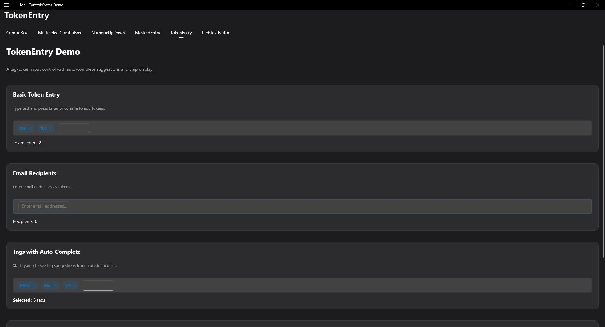

# TokenEntry

A tag/token input control with autocomplete support.



## Features

- **Token Display** - Displays values as removable chips/tags
- **Autocomplete** - Suggestions as you type
- **Validation** - Validate tokens before adding
- **Custom Tokens** - Allow or disallow free-text tokens
- **Keyboard Navigation** - Full keyboard support

## Basic Usage

```xml
<extras:TokenEntry
    Tokens="{Binding Tags, Mode=TwoWay}"
    Placeholder="Add tags..." />
```

## Autocomplete

```xml
<extras:TokenEntry
    Tokens="{Binding SelectedTags}"
    SuggestionsSource="{Binding AvailableTags}"
    DisplayMemberPath="Name"
    SuggestionThreshold="2" />
```

## Restrict to Suggestions

```xml
<extras:TokenEntry
    Tokens="{Binding SelectedItems}"
    SuggestionsSource="{Binding AllItems}"
    AllowFreeText="False" />
```

## Token Separators

```xml
<extras:TokenEntry
    Tokens="{Binding Tags}"
    TokenSeparators=",;|"
    CreateTokenOnSeparator="True" />
```

## Maximum Tokens

```xml
<extras:TokenEntry
    Tokens="{Binding Tags}"
    MaxTokens="5"
    MaxTokensReachedMessage="Maximum 5 tags allowed" />
```

## Token Validation

```xml
<extras:TokenEntry
    Tokens="{Binding Tags}"
    ValidateTokenCommand="{Binding ValidateTagCommand}" />
```

```csharp
public ICommand ValidateTagCommand => new Command<TokenValidationEventArgs>(e =>
{
    if (e.Token.Length < 2)
    {
        e.IsValid = false;
        e.ErrorMessage = "Tag must be at least 2 characters";
    }
});
```

## Keyboard Shortcuts

| Key | Action |
|-----|--------|
| Enter | Create token from current text |
| Backspace | Delete last token (when input empty) |
| Delete | Delete selected token |
| ← | Select previous token |
| → | Deselect token |
| Ctrl+C (⌘C) | Copy selected token |
| Ctrl+X (⌘X) | Cut selected token |
| Ctrl+V (⌘V) | Paste tokens from clipboard |

## Clipboard Support

TokenEntry implements `IClipboardSupport` for copy, cut, and paste operations.

### Copy/Cut

Select a token using arrow keys or by clicking on it, then:
- **Desktop**: Press Ctrl+C/Ctrl+X or right-click for context menu
- **Mobile**: Long-press on a token to show context menu

```csharp
// Programmatic clipboard operations
if (tokenEntry.CanCopy)
    tokenEntry.Copy();

if (tokenEntry.CanCut)
    tokenEntry.Cut();
```

### Paste

Paste text from clipboard to add multiple tokens at once:
- Clipboard text is split by configurable delimiters (default: comma, semicolon, newline, tab)
- Each token is validated before adding
- Invalid tokens are skipped and reported via the `Pasted` event

```csharp
// Paste tokens from clipboard
await tokenEntry.PasteAsync();
```

### Customizing Paste Delimiters

```xml
<extras:TokenEntry
    Tokens="{Binding Tags}"
    PasteDelimiters=",;&#x0A;&#x09;" />
```

```csharp
tokenEntry.PasteDelimiters = new[] { ',', ';', '\n', '\t', '|' };
```

### Clipboard Events

```csharp
tokenEntry.Copying += (sender, e) =>
{
    // e.Tokens contains the token being copied
    // e.Cancel = true to prevent the operation
};

tokenEntry.Cutting += (sender, e) =>
{
    // Same as Copying, but token will be removed after copy
};

tokenEntry.Pasting += (sender, e) =>
{
    // e.Content is the raw clipboard text
    // e.Tokens contains the parsed tokens that will be added
    // e.Cancel = true to prevent the operation
};

tokenEntry.Pasted += (sender, e) =>
{
    // e.SuccessCount - number of tokens successfully added
    // e.SkippedTokens - tokens that were not added
    // e.SkipReasons - dictionary of token -> reason why skipped
    if (e.SkippedTokens.Count > 0)
    {
        Debug.WriteLine($"Skipped {e.SkippedTokens.Count} tokens");
    }
};
```

## Context Menu

TokenEntry implements `IContextMenuSupport` for right-click (desktop) and long-press (mobile) context menus.

### Default Context Menu

By default, a context menu with Copy, Cut, and Paste options is shown. Disable with:

```xml
<extras:TokenEntry
    Tokens="{Binding Tags}"
    ShowDefaultContextMenu="False" />
```

### Custom Context Menu Items

```csharp
tokenEntry.ContextMenuItems.Add("Select All", () => SelectAllTokens());
tokenEntry.ContextMenuItems.Add("Clear All", () => tokenEntry.Clear());
```

### Context Menu Event

```csharp
tokenEntry.ContextMenuOpening += (sender, e) =>
{
    // e.Items - the menu items collection (add/remove items)
    // e.Cancel = true to prevent showing the menu
    // e.TargetElement - the token that triggered the menu (if any)

    e.Items.Add("Custom Action", () => DoSomething());
};
```

## Events

| Event | Description |
|-------|-------------|
| TokenAdded | Token was added |
| TokenRemoved | Token was removed |
| TokenValidating | Token about to be added |
| TextChanged | Input text changed |
| Copying | Before copy operation (cancellable) |
| Cutting | Before cut operation (cancellable) |
| Pasting | Before paste operation (cancellable) |
| Pasted | After paste completes with skipped token details |
| ContextMenuOpening | Before context menu shows (cancellable) |

## Commands

| Command | Description |
|---------|-------------|
| TokenAddedCommand | Execute when token added |
| TokenRemovedCommand | Execute when token removed |
| ValidateTokenCommand | Validate before adding |
| CopyCommand | Execute when copy performed |
| CutCommand | Execute when cut performed |
| PasteCommand | Execute when paste performed |

## Validation

TokenEntry implements `IValidatable` for built-in validation support. This is separate from token-level validation (ValidateTokenCommand).

```xml
<extras:TokenEntry
    Tokens="{Binding Tags}"
    IsRequired="True"
    RequiredErrorMessage="Please add at least one tag"
    ValidateCommand="{Binding OnValidationCommand}" />
```

### Checking Validation State

```csharp
if (!tokenEntry.IsValid)
{
    foreach (var error in tokenEntry.ValidationErrors)
    {
        Debug.WriteLine(error);
    }
}

// Trigger validation manually
var result = tokenEntry.Validate();
```

### Validation Properties

| Property | Type | Default | Description |
|----------|------|---------|-------------|
| IsRequired | bool | false | Whether at least one token is required |
| RequiredErrorMessage | string | "This field is required." | Error message when required but no tokens |
| IsValid | bool | (read-only) | Current validation state |
| ValidationErrors | IReadOnlyList&lt;string&gt; | (read-only) | List of validation error messages |
| ValidateCommand | ICommand | null | Command executed when validation occurs |

## Properties

| Property | Type | Description |
|----------|------|-------------|
| Tokens | IList | Current tokens |
| SuggestionsSource | IEnumerable | Autocomplete suggestions |
| DisplayMemberPath | string | Property to display |
| AllowFreeText | bool | Allow non-suggestion tokens |
| MaxTokens | int | Maximum token count |
| TokenSeparators | string | Characters that create tokens |
| Placeholder | string | Input placeholder text |
| PasteDelimiters | char[] | Characters used to split clipboard text |
| ShowDefaultContextMenu | bool | Show built-in Copy/Cut/Paste context menu |
| CanCopy | bool | (read-only) Whether copy is available |
| CanCut | bool | (read-only) Whether cut is available |
| CanPaste | bool | (read-only) Whether paste is available |
| ContextMenuItems | ContextMenuItemCollection | Custom context menu items |
