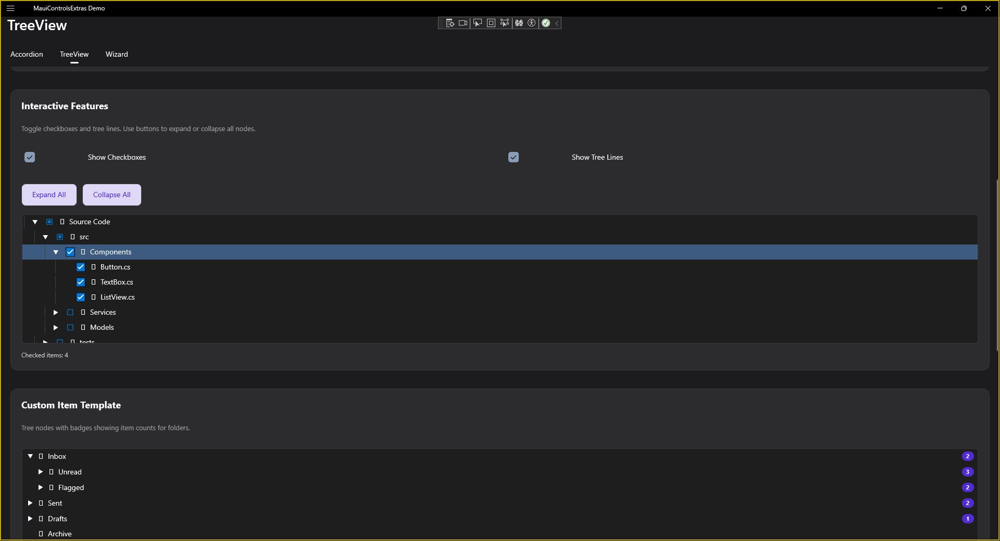
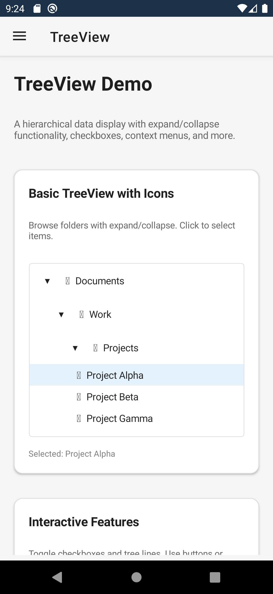

# TreeView

A hierarchical tree control for displaying parent-child relationships.

| Desktop | Mobile |
|---|---|
|  |  |

## Features

- **Hierarchical Data** - Display nested parent-child relationships
- **Expand/Collapse** - Expand and collapse tree nodes
- **Selection** - Single and multiple selection modes
- **Checkboxes** - Optional checkbox support with tri-state
- **Icons** - Custom icons per node
- **Lazy Loading** - Load children on demand
- **Keyboard Navigation** - Full keyboard support

## Basic Usage

```xml
<extras:TreeView ItemsSource="{Binding RootNodes}">
    <extras:TreeView.ItemTemplate>
        <DataTemplate x:DataType="models:TreeNode">
            <Label Text="{Binding Name}" />
        </DataTemplate>
    </extras:TreeView.ItemTemplate>
</extras:TreeView>
```

## Hierarchical Data

```csharp
public class TreeNode
{
    public string Name { get; set; }
    public ObservableCollection<TreeNode> Children { get; set; }
}
```

```xml
<extras:TreeView
    ItemsSource="{Binding RootNodes}"
    ChildrenPath="Children"
    DisplayMemberPath="Name" />
```

## Checkboxes

```xml
<extras:TreeView
    ItemsSource="{Binding RootNodes}"
    ShowCheckBoxes="True"
    CheckedItems="{Binding CheckedItems}"
    CheckBoxMode="TriState" />
```

**CheckBoxMode values:**
- `Independent` - Checkboxes are independent (default)
- `Cascade` - Checking parent checks all children
- `TriState` - Parent shows indeterminate state when some children are checked

## Selection

```xml
<extras:TreeView
    ItemsSource="{Binding RootNodes}"
    SelectionMode="Multiple"
    SelectedItem="{Binding SelectedNode}"
    SelectedItems="{Binding SelectedNodes}"
    SelectionChangedCommand="{Binding HandleSelectionCommand}" />
```

## Lazy Loading

```xml
<extras:TreeView
    ItemsSource="{Binding RootNodes}"
    LoadChildrenCommand="{Binding LoadChildrenCommand}"
    HasChildrenPath="HasChildren" />
```

## Keyboard Shortcuts

| Key | Action |
|-----|--------|
| ↑ / ↓ | Move between nodes |
| ← | Collapse or move to parent |
| → | Expand or move to first child |
| Enter / Space | Toggle expand/select |
| Home / End | First/last node |
| * | Expand all children |
| + / - | Expand/collapse current |

## Events

| Event | Description |
|-------|-------------|
| SelectionChanged | Node selection changed |
| NodeExpanding | Node about to expand |
| NodeExpanded | Node expanded |
| NodeCollapsing | Node about to collapse |
| NodeCollapsed | Node collapsed |
| CheckedChanged | Checkbox state changed |

## Properties

| Property | Type | Description |
|----------|------|-------------|
| ItemsSource | IEnumerable | Root nodes collection |
| ChildrenPath | string | Property path to children |
| DisplayMemberPath | string | Property to display |
| SelectedItem | object | Currently selected node |
| ShowCheckBoxes | bool | Show checkboxes |
| CheckBoxMode | CheckBoxMode | Checkbox behavior: Independent, Cascade, or TriState |
| SelectionMode | SelectionMode | Single or Multiple |
| DisplayMemberFunc | Func\<object, string?\> | AOT-safe alternative to DisplayMemberPath |
| ChildrenFunc | Func\<object, IEnumerable?\> | AOT-safe alternative to ChildrenPath |
| IconMemberFunc | Func\<object, object?\> | AOT-safe alternative to IconMemberPath |
| IsExpandedFunc | Func\<object, bool?\> | AOT-safe alternative to IsExpandedPath |
| HasChildrenFunc | Func\<object, bool?\> | AOT-safe alternative to HasChildrenPath |

## AOT / NativeAOT Support

When publishing with `PublishAot=true` or trimming enabled, string-based property paths use reflection that may be removed by the trimmer.

### Option 1: Use Func-based properties (recommended)

```csharp
myTreeView.DisplayMemberFunc = item => ((TreeNode)item).Name;
myTreeView.ChildrenFunc = item => ((TreeNode)item).Children;
myTreeView.IconMemberFunc = item => ((TreeNode)item).IconPath;
myTreeView.IsExpandedFunc = item => ((TreeNode)item).IsExpanded;
myTreeView.HasChildrenFunc = item => ((TreeNode)item).HasChildren;
```

### Option 2: Preserve model types

```csharp
[DynamicDependency(DynamicallyAccessedMemberTypes.PublicProperties, typeof(TreeNode))]
```

