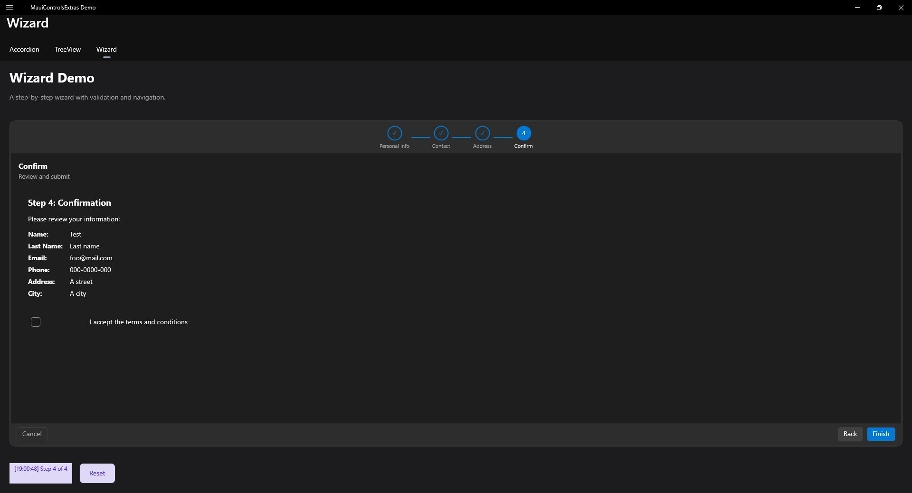
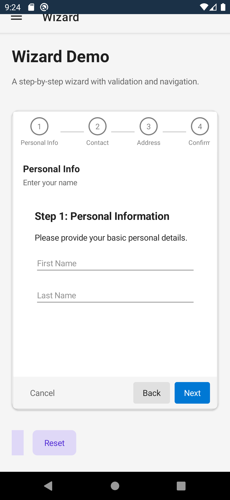

# Wizard

A wizard/stepper control for multi-step workflows with step indicators and navigation.

| Desktop | Mobile |
|---|---|
|  |  |

## Features

- **Step Indicators** - Visual step progress with numbers or custom icons
- **Navigation Modes** - Linear (sequential) or free navigation
- **Validation** - Validate steps before proceeding
- **Animated Transitions** - Smooth step transitions
- **Customizable Buttons** - Configure button text and visibility
- **Keyboard Navigation** - Arrow keys and keyboard support
- **Navigation Colors** - Active, inactive, visited, and disabled state colors (inherited from `NavigationControlBase`)

## Basic Usage

```xml
<extras:Wizard FinishedCommand="{Binding CompleteWizardCommand}">
    <extras:WizardStep Title="Personal Info" Icon="person">
        <VerticalStackLayout>
            <Entry Placeholder="Name" Text="{Binding Name}" />
            <Entry Placeholder="Email" Text="{Binding Email}" />
        </VerticalStackLayout>
    </extras:WizardStep>

    <extras:WizardStep Title="Address" Icon="location">
        <VerticalStackLayout>
            <Entry Placeholder="Street" Text="{Binding Street}" />
            <Entry Placeholder="City" Text="{Binding City}" />
        </VerticalStackLayout>
    </extras:WizardStep>

    <extras:WizardStep Title="Confirm" Icon="check">
        <Label Text="Review your information" />
    </extras:WizardStep>
</extras:Wizard>
```

## Navigation Modes

```xml
<!-- Linear navigation (must complete steps in order) -->
<extras:Wizard NavigationMode="Linear" />

<!-- Free navigation (can jump to any step) -->
<extras:Wizard NavigationMode="Free" />
```

## Step Indicator Styles

```xml
<!-- Circle indicators (default) -->
<extras:Wizard IndicatorStyle="Circle" />

<!-- Progress bar style -->
<extras:Wizard IndicatorStyle="Progress" />

<!-- Numbered indicators -->
<extras:Wizard IndicatorStyle="Number" ShowStepNumbers="True" />
```

## Indicator Position

```xml
<!-- Top (default) -->
<extras:Wizard IndicatorPosition="Top" />

<!-- Left side -->
<extras:Wizard IndicatorPosition="Left" />

<!-- Bottom -->
<extras:Wizard IndicatorPosition="Bottom" />

<!-- Hidden -->
<extras:Wizard IndicatorPosition="None" />
```

## Step Validation

```xml
<extras:Wizard ValidateOnNext="True">
    <extras:WizardStep Title="Step 1"
                       ValidateCommand="{Binding ValidateStep1Command}">
        <!-- Content -->
    </extras:WizardStep>
</extras:Wizard>
```

```csharp
// In ViewModel
[RelayCommand]
private ValidationResult ValidateStep1()
{
    if (string.IsNullOrEmpty(Name))
        return ValidationResult.Failure("Name is required");

    return ValidationResult.Success;
}
```

## Optional Steps

```xml
<extras:WizardStep Title="Optional Info"
                   IsOptional="True"
                   CanSkip="True">
    <!-- Optional content -->
</extras:WizardStep>
```

## Button Customization

```xml
<extras:Wizard
    BackButtonText="Previous"
    NextButtonText="Continue"
    FinishButtonText="Complete"
    CancelButtonText="Exit"
    SkipButtonText="Skip"
    ShowCancelButton="True"
    ShowBackButton="True" />
```

## Code-Behind Navigation

```csharp
// Navigate programmatically
await wizard.GoToNextStepAsync();
await wizard.GoToPreviousStepAsync();
await wizard.GoToStepAsync(2);

// Check navigation state
bool canGoNext = wizard.CanGoNext;
bool canGoBack = wizard.CanGoBack;
bool isLastStep = wizard.IsLastStep;
bool isFirstStep = wizard.IsFirstStep;

// Get current step info
int currentIndex = wizard.CurrentStepIndex;
WizardStep currentStep = wizard.CurrentStep;
```

## Keyboard Shortcuts

| Key | Action |
|-----|--------|
| ← | Previous step |
| → | Next step |
| Page Up | Previous step |
| Page Down | Next step |
| Home | First step (non-linear mode) |
| End | Last step (non-linear mode) |
| Enter | Next step / Finish |
| Escape | Cancel wizard |

## Events

| Event | Description |
|-------|-------------|
| StepChanged | Current step changed |
| StepChanging | Step is about to change (cancelable) |
| Finished | Wizard completed |
| Cancelled | Wizard cancelled |
| StepValidating | Step validation in progress |

## Commands

| Command | Description |
|---------|-------------|
| StepChangedCommand | Execute when step changes |
| FinishedCommand | Execute when wizard completes |
| CancelledCommand | Execute when wizard is cancelled |

## Properties

### Wizard-Specific Properties

| Property | Type | Default | Description |
|----------|------|---------|-------------|
| NavigationMode | WizardNavigationMode | Linear | Linear or Free |
| IndicatorPosition | StepIndicatorPosition | Top | Top, Left, Bottom, None |
| IndicatorStyle | StepIndicatorStyle | Circle | Circle, Progress, Number |
| ShowStepNumbers | bool | true | Show step numbers |
| ShowStepTitles | bool | true | Show step titles |
| ValidateOnNext | bool | true | Validate before next |
| AnimateTransitions | bool | true | Animate step changes |
| CurrentStepIndex | int | 0 | Current step index |
| BackButtonText | string | "Back" | Back button text |
| NextButtonText | string | "Next" | Next button text |
| FinishButtonText | string | "Finish" | Finish button text |
| CancelButtonText | string | "Cancel" | Cancel button text |
| ShowCancelButton | bool | true | Show cancel button |
| ShowBackButton | bool | true | Show back button |
| ErrorStepColor | Color | null | Error step color (falls back to `EffectiveErrorColor`) |

### Step Indicator Styling

| Property | Type | Default | Description |
|----------|------|---------|-------------|
| StepIndicatorBackgroundColor | Color? | null | Step indicator background (falls back to theme surface color) |
| StepIndicatorPadding | Thickness | (12, 8) | Step indicator internal padding |
| StepTitleFontSize | double | 16.0 | Step title font size |
| StepTitleFontAttributes | FontAttributes | Bold | Step title font attributes |

### Inherited from NavigationControlBase

| Property | Type | Default | Description |
|----------|------|---------|-------------|
| ActiveColor | Color? | null | Color for the current step (falls back to accent color) |
| InactiveColor | Color? | null | Color for not-yet-visited steps (falls back to gray) |
| VisitedColor | Color? | null | Color for completed steps (falls back to accent at 60% alpha) |
| DisabledNavigationColor | Color? | null | Color for skipped steps (falls back to light gray) |
| ActiveBackgroundColor | Color? | null | Background color for active navigation items |
| ShowNavigationIndicator | bool | true | Whether to show a visual indicator for the active item |
| NavigationIndicatorColor | Color? | null | Color of the navigation indicator (falls back to accent color) |
| NavigationIndicatorThickness | double | 3.0 | Thickness of the navigation indicator |

