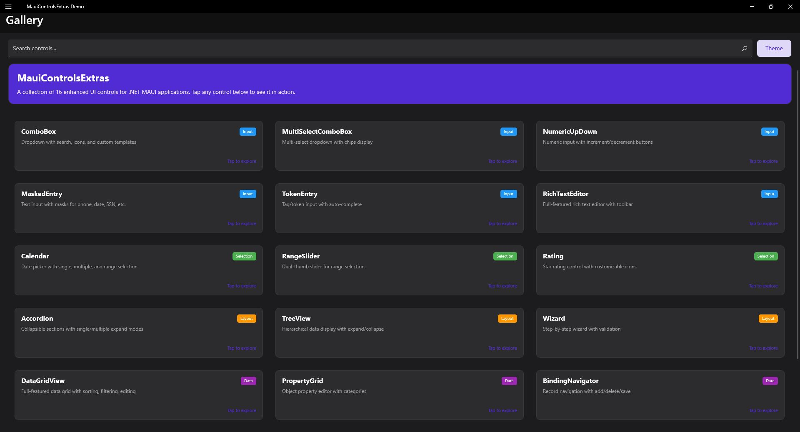

# MAUI Controls Extras

> Enhanced UI controls for .NET MAUI applications

> **Work in Progress**: This library is under active development. APIs may change between releases. See the [Changelog](changelog.md) for breaking changes.

## Overview

MAUI Controls Extras is a library that provides additional UI controls for .NET MAUI applications. These controls fill gaps in the standard MAUI control library, offering functionality commonly needed in mobile and cross-platform applications.

## Demo Application

A complete demo app showcasing all controls is available in the [`samples/DemoApp/`](https://github.com/stef-k/MauiControlsExtras/tree/main/samples/DemoApp) directory.

> **Note**: The demo uses direct event handlers for simplicity. For production apps, we recommend proper MVVM patterns with commands and view models.



## Available Controls

| Control | Description |
|---------|-------------|
| [Accordion](controls/accordion.md) | Expandable/collapsible sections |
| [BindingNavigator](controls/bindingnavigator.md) | Data navigation toolbar |
| [Breadcrumb](controls/breadcrumb.md) | Hierarchical navigation path |
| [Calendar](controls/calendar.md) | Date picker with single, multiple, and range selection |
| [ComboBox](controls/combobox.md) | Searchable dropdown with complex object support |
| [DataGridView](controls/datagridview.md) | Feature-rich data grid with sorting, filtering, editing |
| [MaskedEntry](controls/maskedentry.md) | Text input with format masks (phone, date, etc.) |
| [MultiSelectComboBox](controls/multiselectcombobox.md) | Multi-selection dropdown with checkboxes |
| [NumericUpDown](controls/numericupdown.md) | Numeric input with increment/decrement buttons |
| [PropertyGrid](controls/propertygrid.md) | Property editor similar to Visual Studio |
| [RangeSlider](controls/rangeslider.md) | Dual-thumb slider for range selection |
| [Rating](controls/rating.md) | Star/icon-based rating control |
| [RichTextEditor](controls/richtexteditor.md) | WYSIWYG HTML/Markdown editor |
| [TokenEntry](controls/tokenentry.md) | Tag/token input with autocomplete |
| [TreeView](controls/treeview.md) | Hierarchical tree with expand/collapse |
| [Wizard](controls/wizard.md) | Step-by-step wizard/stepper |

## Key Features

### Cross-Platform Support

- **Android** - Full touch support
- **iOS** - Full touch support
- **macOS Catalyst** - Keyboard, mouse, and touch support
- **Windows** - Full keyboard and mouse support

### Desktop Platform Features

All controls include comprehensive desktop platform support:

- **Keyboard Navigation** - Arrow keys, Tab, Enter, Escape, and standard shortcuts
- **Mouse Interaction** - Click, double-click, right-click, hover, scroll wheel
- **Clipboard Support** - Ctrl+C/V/X for copy/paste operations
- **Undo/Redo** - Ctrl+Z/Y for undoable operations
- **Context Menus** - Right-click menus with standard actions

[Learn more about Desktop Support](platform/desktop.md)

### Developer-Friendly

- **Theme-Aware** - Automatic light/dark mode support
- **MVVM-Friendly** - Full data binding support with commands
- **Well-Documented** - Comprehensive API documentation
- **Consistent API** - Familiar patterns across all controls
- **MIT Licensed** - Free for commercial and personal use

## Quick Example

```xml
<extras:ComboBox ItemsSource="{Binding Countries}"
                 SelectedItem="{Binding SelectedCountry, Mode=TwoWay}"
                 DisplayMemberPath="Name"
                 Placeholder="Select a country..." />

<extras:DataGridView ItemsSource="{Binding Employees}"
                     CanUserEdit="True"
                     EnableSorting="True"
                     EnableFiltering="True">
    <extras:DataGridView.Columns>
        <extras:DataGridTextColumn Header="Name" Binding="Name" />
        <extras:DataGridTextColumn Header="Department" Binding="Department" />
        <extras:DataGridNumericColumn Header="Salary" Binding="Salary" Format="C0" />
    </extras:DataGridView.Columns>
</extras:DataGridView>
```

## Getting Started

1. [Install the NuGet package](installation.md)
2. [Follow the Quick Start guide](quickstart.md)
3. [Explore the Control Documentation](controls/combobox.md)
4. [Read the API Reference](api/combobox.md)
